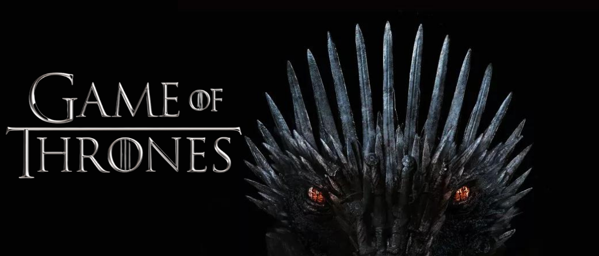
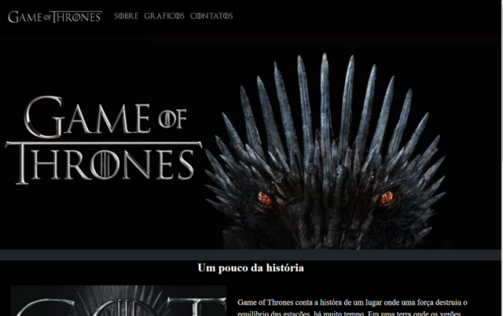
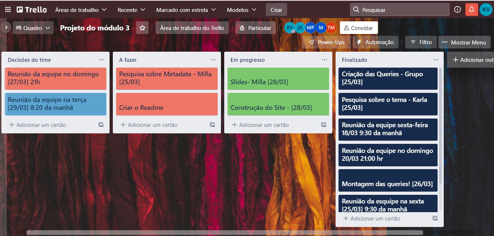
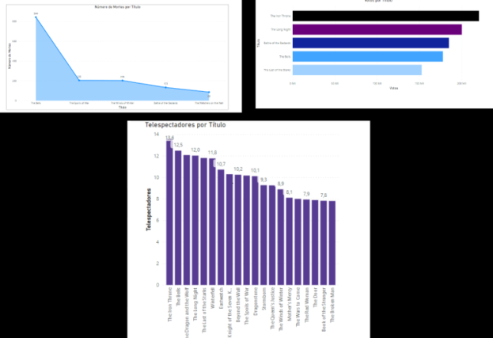
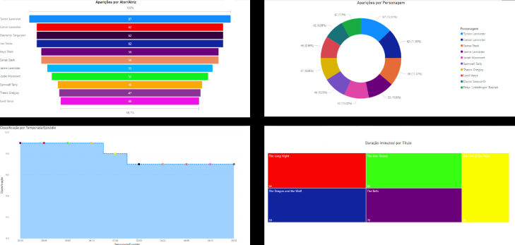
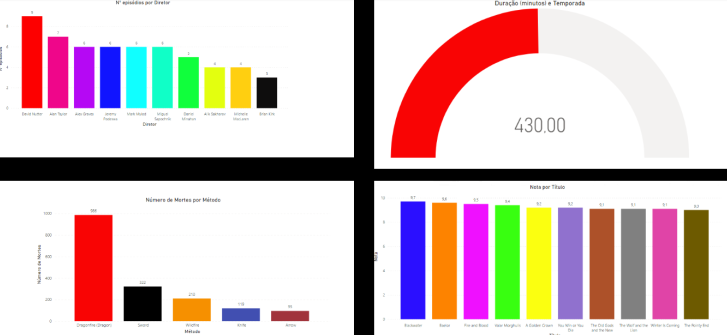
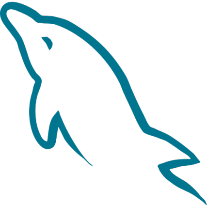
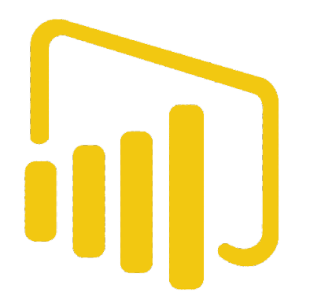
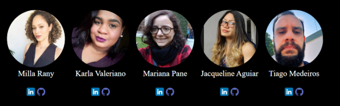

# Game of Thrones
 
   Neste projeto nossa equipe elaborou  uma dashboard com base num conjunto de dados.
   O software utilizado para gerenciamento dos dados foi o MySQL. a partir das informações fornecidas no banco de dados, 17 perguntas foram elaboradas,  e selecionamos 9 delas para ser apresentadas por meio de gráficos.
    
    
     
   
   Para uma demonstração mais detalhada do projeto desenvolvemos um site em HTML, Bootstrap e CSS.
    
   
 
### Metologias ágeis
Na organização da equipe usamos  a metodologia ágil SCRUM, e na divisão das tarefas foi utilizado o método KANBAN com a ferramenta Trello.
 

 

### Gráficos

 

 

  

 ### Ferramentas utilizadas
 
 
 
 
 
 
 
 
 

###  Equipe de desenvolvimento

   